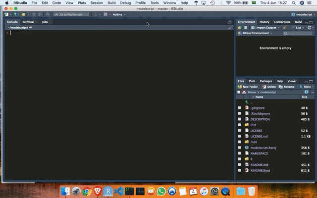

# scriptR

<!-- badges: start -->

<!-- badges: end -->

scriptR is a little [RStudio](https://rstudio.com/) addin that Custom
Format Scripts, Gatsby MDX And Markdown..

## Installation

You can install scriptR with
[remotes](https://github.com/r-lib/remotes):

``` r
remotes::install_github("RudyMartin/scriptR")
```

## Usage



## Template

The template contains a prep and a model building section. ‘prep’
contains subsections for:

  - libraries
  - data
  - EDA
  - tidy
  - visualize

‘Build Model’ contains subsections for:

  - 1: Initial Split
  - 2: Preprocessing
  - 3: Model Specification
  - 4: Hyperparameter Tuning Specification
  - 5: Bundle into Workflow
  - 6: Cross Validation
  - 7: Tune
  - 8: Explore Tuning Results
  - 9: Finalize Workflow
  - 10: Final Fit
  - 11: Evaluate
